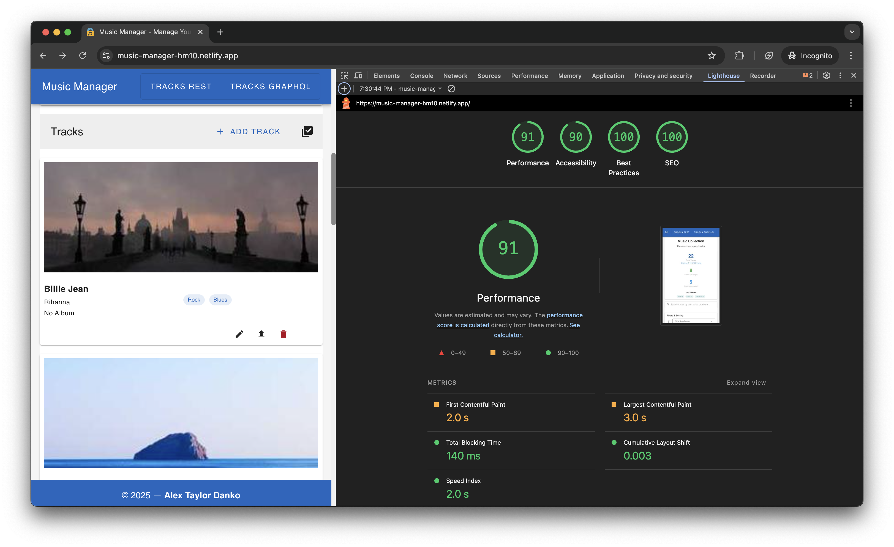

# Music Track Manager - Alex Taylor Danko
<code>[](https://www.linkedin.com/in/dankozz1/)</code>
<code>[](https://t.me/dankozz1)</code>

## Tech Stack
- Vue 3 with Composition API and `<script setup>` syntax
- TypeScript
- Vite
- Vuetify 3
- Vue Router
- Pinia
- Axios
- SCSS
- ESLint and Prettier
- vue/test-utils + vitest + playwright
- My brain + AI to speed up time

## Project Setup

1. Install dependencies:
   ```bash
   npm install
   ```

2. Run the project:
   ```bash
   npm start
   ```

After running, the application will be available at: http://localhost:3000

## Running Tests

To run all tests:

```bash
npm run test:vitest
npm run test:playwright
```
### Link to [Check Testing Preview](./tests/result/DIAGRAM.md)
---

## Music Manager Architecture Decision Records (ADR)
- [docs -> ADR ->  README.md](./docs/ADR/README.md) —  All architectural decisions 

## Music Manager Security Audit 
- [docs -> security-audit ->  README.md](./docs/security-audit/README.md) —  Security Report

## Bundle Analysis & Performance

add to env `VITE_IS_DEBUG=true`

```bash
# Analyze bundle with interactive tool
npm run analyze

# Run size analysis
npm run analyze:size

# Generate bundle report
npm run build:report
```

---

# Visual Demonstration  
- 
- 
- 
- 
- 
- 
- 
- 

